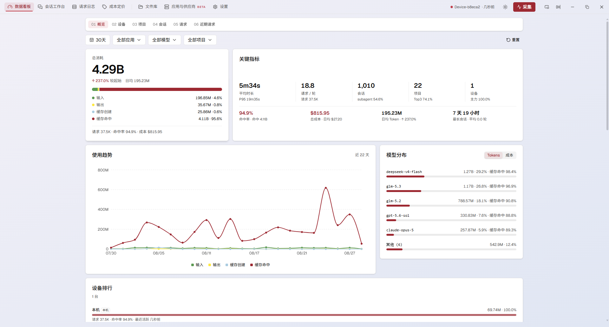
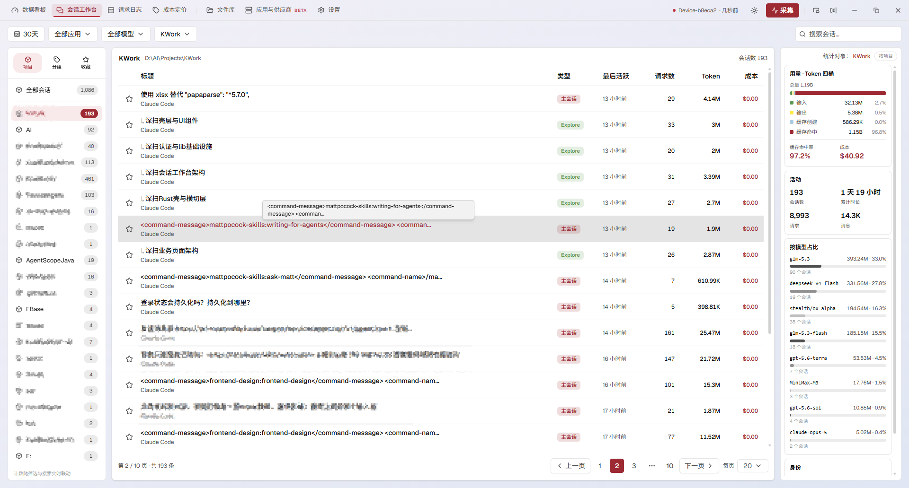
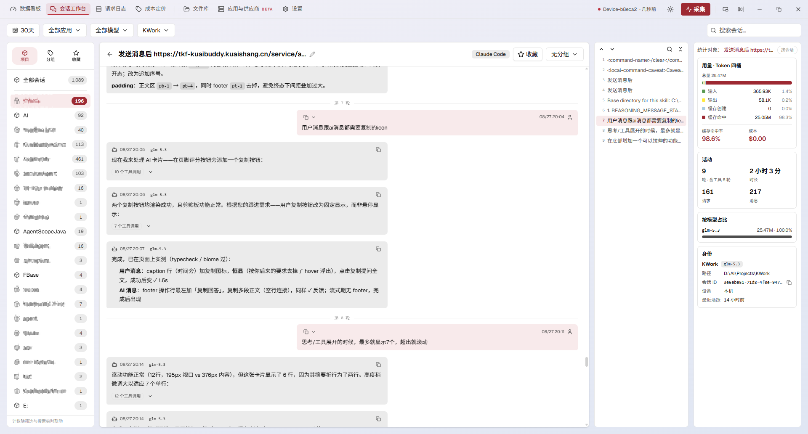
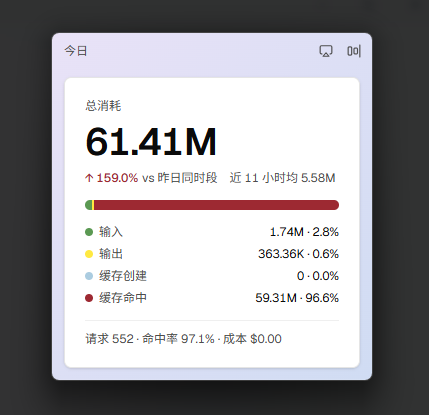

<div align="center">

# CC One

**AI 编码 CLI 的用量看板与供应商管理器**

[](https://github.com/Buktal/cc-one/releases/latest)
[](LICENSE)
[](https://github.com/Buktal/cc-one/releases/latest)

[English](README.md) | [简体中文](README.zh-CN.md) | [日本語](README.ja-JP.md)



</div>

CC One 是一款桌面应用,将 AI 编码 CLI 的本地会话日志转化为用量洞察——Token、成本、趋势与会话——并管理其供应商配置。数据全部存储于本地 SQLite;启用多设备同步后,数据经由您自有的私有 Git 仓库交换,访问令牌仅保存在本机。

## 功能

### 数据看板

- 五个维度:概览、设备、项目、会话、请求。
- Token 四桶核算——输入、输出、缓存创建、缓存命中——附缓存命中率、请求数与成本。
- 使用趋势、每日请求量、轮次与时长分布、模型占比、设备与项目排行。
- 请求级日志,逐条展开成本明细(输入 / 输出 / 缓存读 / 缓存写、计费模型、停止原因)。

### 会话工作台

<table>
<tr>
<td></td>
<td></td>
</tr>
</table>

- 按项目、分组、收藏三类视图导航会话;支持批量收藏、批量分组、批量删除。
- 完整对话原文阅读,支持轮次导航、会话内搜索与消息复制。
- 本地分组仅存本机;收藏与收藏分组跨设备同步。

### 供应商管理(Beta)

- 每个应用独立的供应商池,单激活模式(OpenCode 为附加模式:多个供应商共存于同一配置)。
- 内置配置预设、模型角色映射(含 Claude Code 的 1M 上下文标记)、按应用共享的通用配置片段,合并时供应商配置优先。
- 切换仅重写供应商受控字段,配置文件中的其余字段原样保留;写入原子化、先备份,内容无变化时幂等。
- 支持从 CC-Switch 与现有配置文件导入。

### 多设备同步

- 数据经由您自有的私有 Git 仓库交换,走 HTTPS 与个人访问令牌;令牌仅存储于本机。
- 用量数据、收藏会话、收藏分组与每设备文件库均按设备隔离,以 Git 版本化管理。

<table>
<tr>
<td></td>
<td>

### 悬浮用量卡

贴附屏幕边缘的紧凑卡片,一览今日消耗——Token 四桶、缓存命中率、请求数与成本;主窗口最小化到托盘后自动收起。

</td>
</tr>
</table>

### 其他功能

- 模型计价可配置:内置价格表、自定义条目、LiteLLM 拉取、导入与导出。
- 每设备独立的文件库,经同步仓库版本化管理。
- 经 GitHub Releases 应用内自动更新。
- 界面支持 English / 日本語 / 中文;明暗主题与多套配色皮肤。
- 支持托盘常驻与后台采集。

## 支持的 CLI

| CLI | 用量解析 | 供应商管理 |
| --- | :---: | :---: |
| Claude Code | ✓ | ✓ 单激活 |
| Codex CLI | ✓ | ✓ 单激活 |
| Gemini CLI | ✓ | ✓ 单激活 |
| Grok CLI | ✓ | ✓ 单激活 |
| OpenCode | ✓ | ✓ 附加 |

## 安装

从 [Releases](https://github.com/Buktal/cc-one/releases/latest) 下载安装包:

| 平台 | 安装包 |
| --- | --- |
| Windows(x64) | `CC.One_*_x64-setup.exe` 或 `CC.One_*_x64_en-US.msi` |
| macOS(Apple Silicon) | `CC.One_*_aarch64.dmg` |
| Linux(x86_64) | `CC.One_*_amd64.deb` / `CC.One_*_1.x86_64.rpm` / `CC.One_*_amd64.AppImage` |

应用会检查 GitHub Releases 并在应用内完成自动更新。

## 从源码构建

前置要求:Node.js ≥ 20、Yarn 4、Rust 工具链,以及 [Tauri 2 平台依赖](https://v2.tauri.app/start/prerequisites/)。

```sh
yarn install
yarn dev      # 以开发模式运行应用
yarn check    # 代码检查与类型检查(Biome、tsc、clippy、rustfmt)
yarn test     # 测试套件(Vitest、cargo test)
yarn dist     # 构建分发包
```

## 许可证

[MIT](LICENSE)
